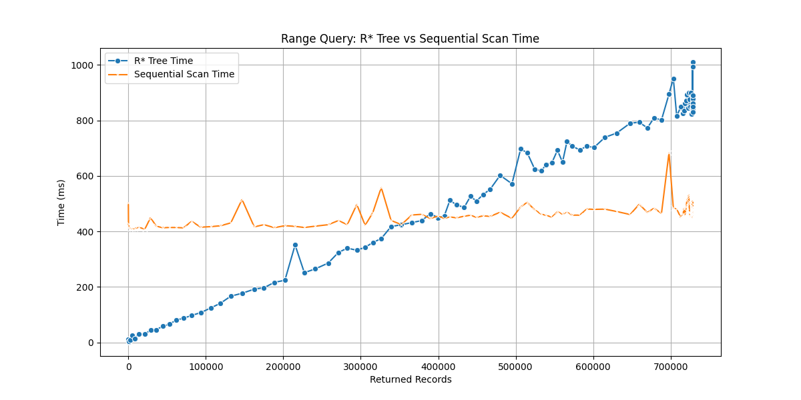
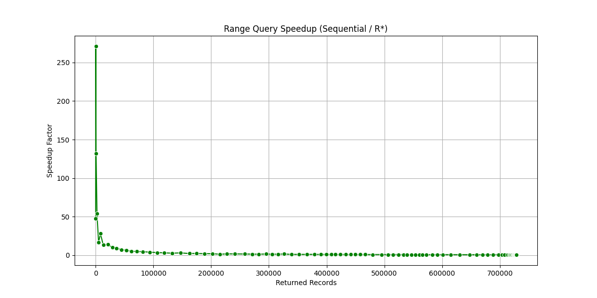
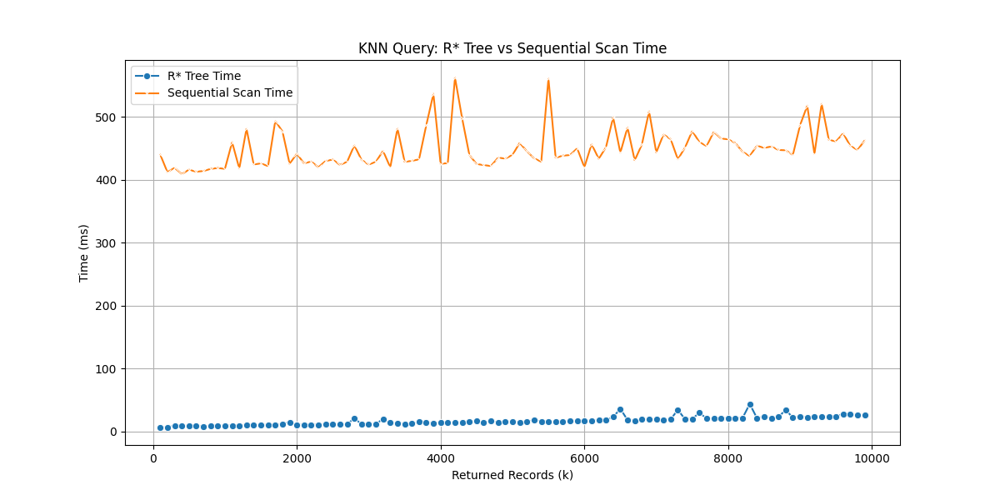
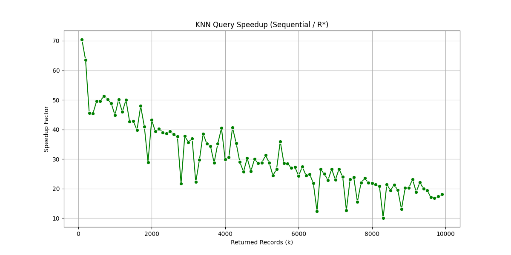

# R-tree Spatial Queries

A Java implementation of an R\*-tree spatial index for efficient querying of OpenStreetMap (OSM) data, with support for range queries, k-nearest neighbor searches, and skyline queries.

## Prerequisites

- Java 8 or higher
- An OpenStreetMap (.osm) XML file

## Data Pipeline

The application follows a three-stage pipeline:

```
OSM File (.osm) → DataFile (datafile.dat) → IndexFile (indexfile.dat)
```

### Stage 1: OSM Parsing

- **Input**: OpenStreetMap XML file containing spatial data
- **Processors**:
  - `DataFileManagerWithName`: Extracts named locations only
  - `DataFileManagerNoName`: Extracts all coordinate points
- **Output**: List of `Record` objects with coordinates and metadata

### Stage 2: DataFile Creation

- **Process**: `helper.CreateDataFile()`
- **Function**: Organizes records into 32KB blocks for efficient storage
- **Output**: `datafile.dat` - Binary file containing serialized spatial records
- **Location**: Generated in `src/` directory

### Stage 3: IndexFile Creation

- **Process**: R\*-tree construction via `RStarTree` or `BulkLoadingRStarTree`
- **Function**: Builds spatial index structure pointing to datafile blocks
- **Output**: `indexfile.dat` - Binary file containing R\*-tree nodes
- **Location**: Generated in `src/` directory

## Architecture Types

### 1. Standard R\*-tree (Incremental Loading)

- **Class**: `RStarTree`
- **Method**: Records inserted one-by-one with dynamic tree restructuring
- **Data Manager**: `DataFileManagerNoName` (named locations only)
- **Characteristics**:
  - Smaller dataset (~9K records for Malta)
  - Dynamic insertion with overflow treatment
  - Supports insertions after initial construction

### 2. Bulk Loading R\*-tree

- **Class**: `BulkLoadingRStarTree`
- **Method**: Sorts all records and builds tree bottom-up
- **Data Manager**: `DataFileManagerNoName` (all coordinate points)
- **Characteristics**:
  - Larger dataset (~729K records for Malta)
  - More efficient initial construction
  - Better space utilization

## Query Types

### Range Query (`BoundingBoxRangeQuery`)

Finds all points within a rectangular bounding box.

### K-Nearest Neighbors (`NearestNeighboursQuery`)

Finds the k closest points to a given coordinate.

### Skyline Query (`SkylineQuery`)

Identifies non-dominated points within a bounding box region.

## Performance Analysis Results

The performance results are derived from running the `Run2DQueries.java` script, which benchmarks the R\* tree against sequential scan for range and k-nearest neighbor (KNN) queries using variable parameters:

- **Range Queries**: Iteratively increases the query bounding box size (starting from a small area and expanding) to test performance across different selectivity levels (number of returned records). Each iteration runs a range query on the R\* tree and a sequential scan, measuring execution times.
- **KNN Queries**: Varies the value of k (number of nearest neighbors) from 100 to 9,900, running KNN queries on the R\* tree and sequential scan for each k value.

This setup allows comparison of query performance as the query becomes less selective (more records returned for range queries) or as k increases (more neighbors for KNN queries). The results highlight when spatial indexing provides benefits over brute-force scanning.

Based on these benchmark runs:

### Range Query Performance

- **Total Iterations**: 100
- **Average R\* Tree Time**: 538.21 ms
- **Average Sequential Scan Time**: 459.65 ms
- **Average Speedup (Sequential / R\*)**: 0.85x (sequential is faster on average for large ranges)
- **Returned Records Range**: 0 to 728,398
- **Observation**: For small ranges (few returned records), R\* tree is faster due to indexing. For large ranges (many records), sequential scan can be faster as it avoids index overhead.





### K-Nearest Neighbors (KNN) Query Performance

- **Total Iterations**: 99
- **Average R\* Tree Time**: 16.82 ms
- **Average Sequential Scan Time**: 449.21 ms
- **Average Speedup (Sequential / R\*)**: 26.71x (R\* tree is significantly faster)
- **Returned Records Range**: 100 to 9,900 (k values)
- **Observation**: R\* tree consistently outperforms sequential scan for KNN queries, with speedup increasing as k grows. This demonstrates the effectiveness of spatial indexing for proximity searches.





These results highlight that R\* trees excel in selective queries (small ranges or specific k values) but may not provide benefits for very large, unselective queries where sequential scanning is more efficient.

## Generated Files

When you run the applications, the following files are generated in the `src/` directory:

- `datafile.dat`: Binary file containing spatial records organized in 32KB blocks
- `indexfile.dat`: Binary file containing the R\*-tree index structure (must be specifies in the source code)
- `output2DRangeQuery.csv`: CSV output from range query results (when enabled)
- `output2DRangeQueryBulkLoaded.csv`: CSV output from bulk-loaded range queries

## Troubleshooting

### "Block size read was not of 32768bytes" Error

This indicates a corrupted or incomplete index file. Solutions:

1. Delete `indexfile.dat` and run the program again to rebuild
2. Ensure the OSM file exists and is accessible
3. Set `reconstruct = true` in test classes to force rebuilding

### "FileNotFoundException: malta.osm"

Place your OSM file in the correct directory (project root) or modify the file path in the source code.

### Different Record Counts

- `DataFileManagerNoName` extracts only named locations (~9K for Malta)
- `DataFileManagerNoName` extracts all coordinates (~729K for Malta)
- Choose the appropriate manager based on your use case
